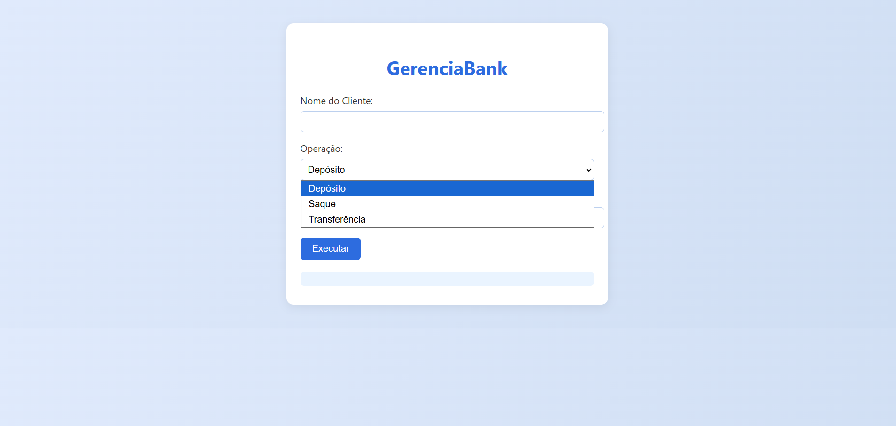

# GerenciaBank

Este projeto é uma aplicação Java para gerenciamento bancário, desenvolvida como parte de estudos ou para fins acadêmicos. Utiliza Maven como ferramenta de build e organização de dependências.

## Funcionalidades
- Cadastro de clientes
- Gerenciamento de contas bancárias
- Operações básicas como depósito, saque e transferência
- Estrutura modular para fácil manutenção e expansão

## Estrutura do Projeto
```
pom.xml
src/
  main/
    java/
      com/
        mycompany/
          gerenciabank/
            GerenciaBank.java
  test/
    java/
target/
```

## Como executar
1. Certifique-se de ter o Java (JDK 8 ou superior) e o Maven instalados.
2. No terminal, navegue até a pasta do projeto e execute:
   ```
   mvn compile
   mvn exec:java -Dexec.mainClass="com.mycompany.gerenciabank.GerenciaBank"
   ```

## Como contribuir
Sinta-se à vontade para abrir issues ou enviar pull requests com melhorias, correções ou novas funcionalidades.

## Autor
Desenvolvido por Andrei Rodrigues.

## Demonstração de habilidades Front-End

Como parte da iniciativa de explorar e sinalizar minhas habilidades em desenvolvimento web, criei uma interface front-end estilizada em HTML, CSS e JavaScript, disponível no arquivo `demo.html`. Essa interface simula as principais operações bancárias do sistema, permitindo uma experiência visual e interativa para o usuário.

- Interface responsiva e moderna
- Uso de CSS externo para organização e boas práticas
- Simulação das operações de depósito, saque e transferência

Para visualizar, basta abrir o arquivo `demo.html` no navegador.

## Exemplo da Interface

Abaixo estão imagens da interface desenvolvida para o GerenciaBank, demonstrando minhas habilidades em front-end:

![Tela inicial da interface]


![Operação de depósito realizada]


![Seleção de operação]


---
Este projeto é apenas para fins educacionais e não deve ser utilizado em produção sem as devidas adaptações de segurança e escalabilidade.
